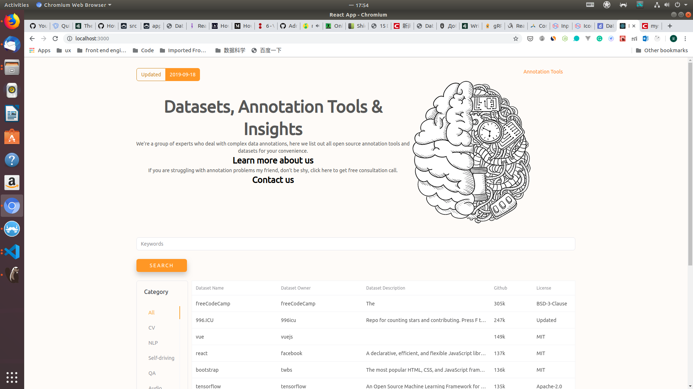

## Another Github Spider yet.

[]()
[]()
[]()
[]()
[]()
[]()


### Overview
`DatasetList` is a simple full stack personal project.  
This project is about how to mining the data from by using [`scrapy framework`](https://scrapy.org/)
which include the `data spider, back end and front end`.

#### skills
##### backend
- python_v3.6
- django_v2
- djangorestframework_v3
##### frontend
- react_v16.9 (react hooks)
##### data mining
- scrapy_v1.7
##### database
- mysql

### Run development environment
#### get into the python virtual env and install the requirements
```bash
cd datasetlist
python3.6 -m venv .
source bin/activate
pip install -r requirements.txt
```
#### setup the database and run backend service
```bash
# into the server folder
python manage.py migrate
python manage.py makemigrations
python manage.py createsuperuser
```

#### scrapy the data
```bash
# into the githubscrapy folder
scrapy crawl github
```

#### run the frontend service
```bash
# into the frontend folder
yarn install
yarn start
```


### TODO

- [ ] Participle
- [ ] Classifier: Bayes
- [ ] deep into react hooks
- [ ] write rpc service for php service

### Contact
- Email: lucky_soft@163.com
- Twitter: [@lemond520](https://twitter.com/lemond520)

### About Labelhub
We’re a group of experts who deal with complex data annotations, here we list out all open source annotation tools and datasets for your convenience.